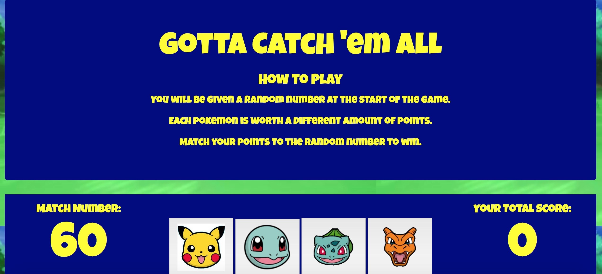

# unit-4-game
 
Created collector game interface using html and css. Used Jquery through javascript to program game mechanics using random number generators and assigning values to the buttons on the html page.

# technologies used
html, css, javascript, JQuery

# authors
Alton Shu
